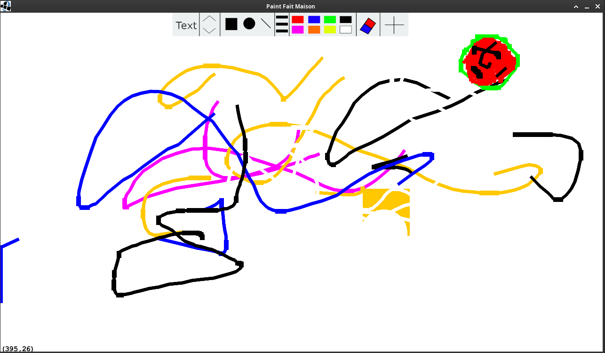
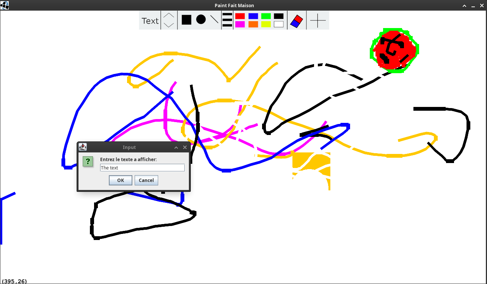
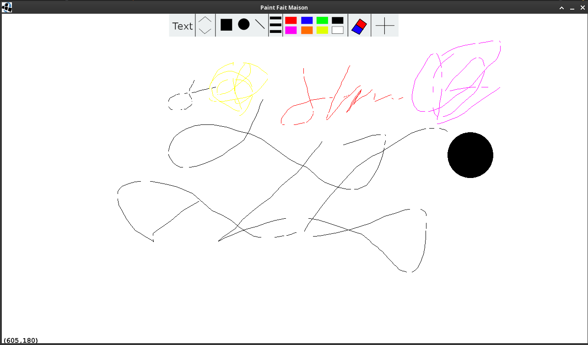

# Paint-Slick2D
An old 1st (2020) year Paint project in an outdated Java library, Slick2D.

It was done using a lot of quick-fixes and exploiting existing bugs. The library Slick2D has been abandoned for many years and its documentation barren. So this project gave me the opportunity to learn to explore a full framework with experimentation and reasoning through reading all the methods and classes.

## Steps to use
The projects was developped using [Eclipse](https://www.eclipse.org/downloads/), Slick2D and LWJGL 2.9.3. To install, add Slick2D to the User Libraries.

Add it in "Windows -> Preferences -> Java -> Build Path -> User Library", click New and name it "Slick2D" and add all the extracted .jar with Add External JARs (except slick-examples.jar). Then once in the Library choose the version of lwjgl under lwjgl-2.9.3/native/{YOUR OS}.

Then, extract clone the project with ``git clone git@github.com:usama-elm/paint-slick2D.git`` and add the project on Eclipse under "Open Projects from File System".

Add the User Library to the project and then run it. If there is any use [just contact me](mailto:usama@usama.pro).

## A little showing of the project
This project is very barren, it has a few functionalities tho:
- Changing colors
- Coordinates in the corner
- Line, free drawing, circle and rectangle
- Thickness toggle
- Rubber
- Clearing the screen

